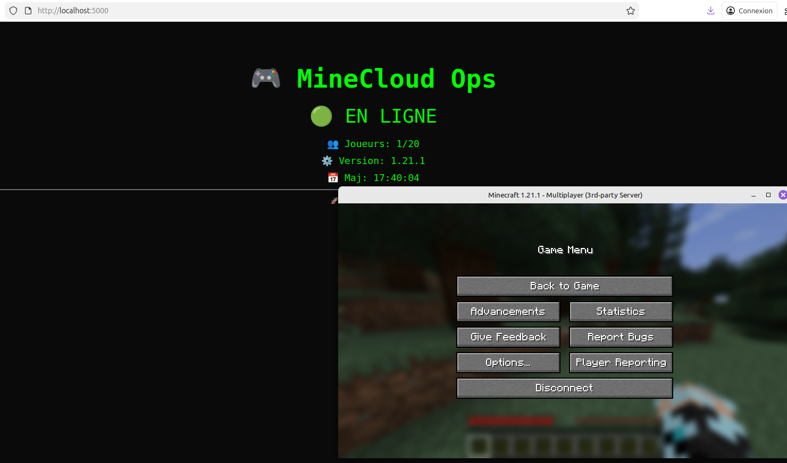

# ☁️ MineCloud IaC

   

MineCloud est un projet d'**Infrastructure-as-Code** complet. Il automatise le déploiement d'un serveur Minecraft et d'une API de monitoring sur une VM Debian 13 via **VirtualBox**.

---

## 📂 Structure du projet

```text
.
├── packer/          # Image ISO Debian 13 personnalisée
├── terraform/       # Provisioning VM VirtualBox
├── ansible/         # Configuration et déploiement Docker
├── app/             # Code source (Flask + Docker Compose)
└── screen.png       # Capture d'écran du projet
```
## 🚀 Déploiement 

Télécharger le dépot :
```git clone https://github.com/WhatIsLove/Minecloud.git```

Placer son iso dans ```packer/```

Lancer : ```make all```


📊 Accès aux services
```text
Service	Adresse	Port
Minecraft	localhost	25565
API Flask	http://localhost	5000

```

📸 Screenshot

